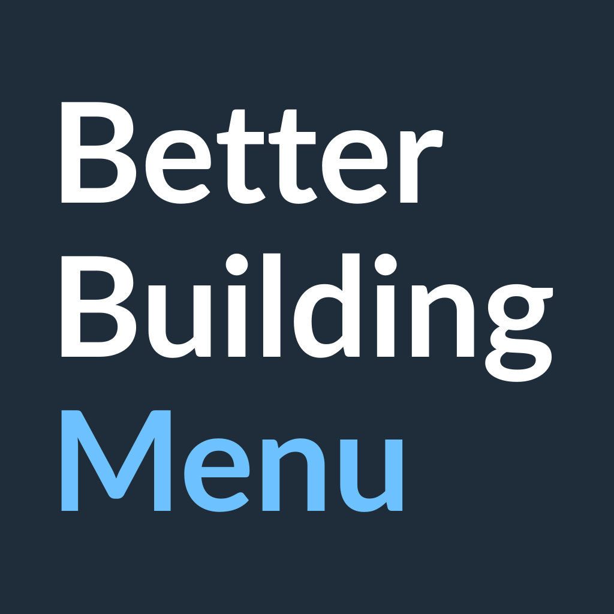

# Better Building Menu

A Cities: Skylines II mod. Click any build menu on the toolbar and, instead of
the row of icons, you get a panel: search, the menu's category tabs, and its
assets as a grid, list, cards or table, with sorting, grouping, filters and
stats on hover. The menu you clicked decides what is in the list.

Published on Paradox Mods as [mod 158589](https://mods.paradoxplaza.com/mods/158589/Windows).
The listing there is the player-facing description; this file is for people
working on the code.

---

## Layout

* `BetterBuildingMenu/` — the C# mod (systems, prefab index, options) and the
  UI under `UI/` (React, built into the mod's `.mjs` bundle).
* `BetterBuildingMenu.Tests/` — the C# tests.
* `BetterBuildingMenu/Properties/` — store listing (`PublishConfiguration.xml`),
  logo, cover and screenshots.

## How it fits together

1. `PrefabIndexingSystem` indexes every prefab once per load, and again for
   prefabs that change.
2. `BuildingCatalogAdapter` projects that index into catalog rows.
3. For each refresh, `CatalogView` scopes the rows to the open menu, has
   `BuildingCatalogQueryEngine` filter, sort and page them, and works out the
   tabs, facets and metric ranges alongside.
4. `BuildingMenuUISystem` publishes the results as bindings.
5. The React UI, which extends vanilla's `AssetMenu`, draws them, and sends
   what the player does back as triggers.

The query state lives in C# (`BuildingCatalogLensState`), so the UI never
holds more than a page. Terms are in the glossary in
[CONTRIBUTING.md](CONTRIBUTING.md).

## Build and test

```sh
./build.sh all                              # C# (Debug) and UI
./build.sh test                             # C# tests
(cd BetterBuildingMenu/UI && npm test)      # UI typecheck, lint, unit and render suites
```

Setup, packaging and deploying are in [CONTRIBUTING.md](CONTRIBUTING.md).

## Docs

* [CONTRIBUTING.md](CONTRIBUTING.md): setup, building and trying it in game,
  boundaries, the rule for comments and docs, glossary.
* [docs/roadmap.md](docs/roadmap.md): open work.
* [docs/release-checklist.md](docs/release-checklist.md): what to run before
  a release.
* [docs/ci.md](docs/ci.md): what CI runs, and the private game assemblies the
  C# job builds against.
* [docs/compatibility.md](docs/compatibility.md): how popular mods fare
  beside this one, and why.
* [docs/indexing.md](docs/indexing.md) and
  [docs/design-notes.md](docs/design-notes.md): the reasoning behind the
  indexer and the UI, pointed to from the code.
* [docs/vanilla-upgrades.md](docs/vanilla-upgrades.md): how vanilla handles
  building upgrades and extensions.
* [docs/FORK.md](docs/FORK.md): provenance and license.

## Compatibility

Find It may be installed alongside. Its window takes the asset-menu slot while
open and this panel returns when it closes; the object picker is Find It's
alone. No Harmony patches; nothing is written to the save. Other mods are in
[docs/compatibility.md](docs/compatibility.md).

## Credits

Forked from **Find It 1.5.8** by **T. D. W.** and rebuilt around the vanilla
menus. Credits carried over from that project: **YenYang** (UI),
**Algernon** (contributions, and for allowing the original project to be taken
on), **Chameleon** (icons), **Baka-gourd** (focus handling). MIT licensed; see
[LICENSE](LICENSE), and [docs/FORK.md](docs/FORK.md) for the basis.
